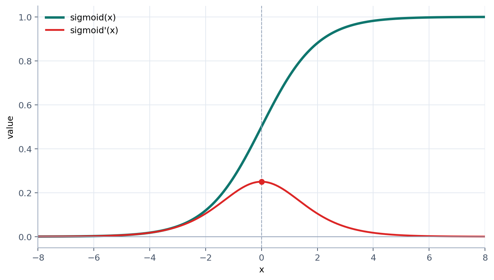

## 多层感知机

不只明斯基，罗森布拉特也意识到异或问题的解法在于多层网络，但他直至去世都没有找到一个可行的训练算法。

今天回头看，困住罗森布拉特的有几个因素：

**阶跃函数**：当时的神经网络使用阶跃函数作为激活函数，这种函数在输入达到某个阈值时输出 1，否则输出 0。这个设计源于对生物神经元的忠实模仿。在那个时代，M-P 模型的成功让人们坚信神经元必须是对生物神经的完全模仿。然而，阶跃函数的非连续性导致了微积分无法应用，无法计算梯度，也就无法使用梯度下降法来训练多层网络。用明斯基的话说：“你无法用平滑的微积分去训练这种离散的开关。”

**局部最优解**：如果把多层网络的训练过程想象成在一个高维空间中寻找最低点，明斯基认为这个空间充满了局部最优解。罗森布拉特依赖于梯度下降法来训练网络，但在复杂的高维空间中，梯度下降很容易被局部最优解困住，无法找到全局最优解。就像在没有地图的情况下在山中行走一样，可能会被卡在半山腰的小坑里。罗森布拉特推断，随着网络层数变深，参数变多，地形会变得千沟万壑，掉进陷阱的概率将呈指数级上升。这就像是一个盲人在充满了捕兽夹的森林里行走，每一步都可能是终点。

**计算资源的限制**：1969 年，计算机的算力非常有限。即使罗森布拉特想到了反向传播算法，现实也会无情地嘲弄他。在那种算力下，训练一个仅能解决 XOR 问题的简单多层网络，可能需要机器轰鸣运转数小时甚至数天。即使罗森布拉特灵光乍现，想到了反向传播算法，现实的算力限制也会让这个算法变得不可行。在无法做实验的情况下，科学家只能迷信纸面上的推导。计算复杂性理论告诉他，这是一个 NP-Hard 问题。他悲观地计算出，要在这个庞大的参数空间里搜索出合适的权重组合，所需要的时间将 “超过宇宙的寿命”。

## BP 算法

1986 年，辛顿（Geoffrey Hinton）和鲁梅尔哈特（David Rumelhart）、威廉姆斯（Ronald J. Williams）发表了论文《通过反向传播误差学习表征》（Learning representations by back-propagating errors），宣告了神经网络的苏醒。

为了让微积分的链式法则能够应用，辛顿把原来用来模拟生物学的布尔代数抛在了一边，把 0 和 1 的阶跃函数改成了平滑的S曲线（Sigmoid函数）。

具体来说，BP 算法的机制大致为：

1. **前向传播 (Forward Pass)**：数据从输入层经过隐藏层，一路计算到输出层，给出一个预测值（比如 0.8）。

2. **计算损失 (Loss)**：对比预测值（0.8）和真实值（1.0），算出误差（Loss = 0.2）。

3. **反向传播 (Backward Pass)** ：为了减小这 0.2 的误差，每个权重应该怎么改，改多少？实际上没人知道结果，但是可以用试的方法来解决。尝试的过程中，可以用求偏导的方式来指引方向，找到那个最敏感的权重。在偏导的指导下，通过逐步、一点点地调整权重，就能找到那个正确的对权重调整的方案了。

由于魔改了阶跃函数，辛顿团队将微积分的能力引入了神经网络，使用链式法则来计算误差的传播，使得多层网络的训练成为可能。1986 年的计算机也比罗森布拉特时代的算力更强大一些。此外，明斯基预言、罗森布拉特担心的局部最优解问题在实际训练中并没有成为困难。后来，高维统计学的研究揭示了一个反直觉的真理：在高维空间中，局部最优解其实很稀少，更多的是鞍点（saddle points）和高原（plateaus）。鞍点和高原虽然也会让训练变慢，但并不会像局部最优解那样完全卡死训练过程，只要加入一些随机性，梯度下降很容易跳出这些陷阱。

辛顿团队用实验无可辩驳地证明：多层网络不仅能训练，而且能完美解决单层感知机无法解决的非线性问题。他们针对性地选择了那些曾经被明斯基宣判 “死刑” 的各种编码和逻辑问题（如 XOR 问题、编码器问题）进行演示，直接挑战明斯基的权威，打破了学术界的坚冰。

然而，当时的学术环境对 “神经网络” 几乎到了敌视的程度，将其视作伪科学。辛顿为了发论文，甚至发明了一个新词以避免使用神经网络这个已经被严重污名化的词 —— 并行分布处理 (Parallel Distributed Processing, PDP)。由于无法进入主流视野，他们只能在加州大学圣地亚哥分校（UCSD）等少数几个据点，组织自己的小圈子会议。

在技术层面，他们也遇到了新的问题。论文虽然解决了 “怎么传误差” 的问题，却引发了新的数学灾难。当研究者试图把网络做深超过三层时，反向传播失效了：因为梯度消失。

## 梯度消失问题

BP 算法的核心是链式法则，计算梯度时的公式为：

$$
\text{总梯度} = \text{最后一层的导数} \times \text{倒数第二层的导数} \times \dots
$$

当时用来作为引入非线性特征的函数叫做 Sigmoid 函数：

$$
\text{Sigmoid(x)} = \frac{1}{1 + e^{-x}}
$$

Sigmoid 函数的导数最大值只有 0.25（当输入为 0 时）。在边缘区域，导数更是接近 0。假设有十层网络，那么计算结果就是：

$$
0.25 \times 0.25 \times 0.25 \dots \approx 0.0000009
$$

这会导致误差信号传回到第 1 层时信号已经微弱到几乎为零。深层的神经元在疯狂学习（因为靠近输出，梯度大），但浅层的神经元（负责提取基础特征）几乎没动静。这就是所谓的梯度消失问题。