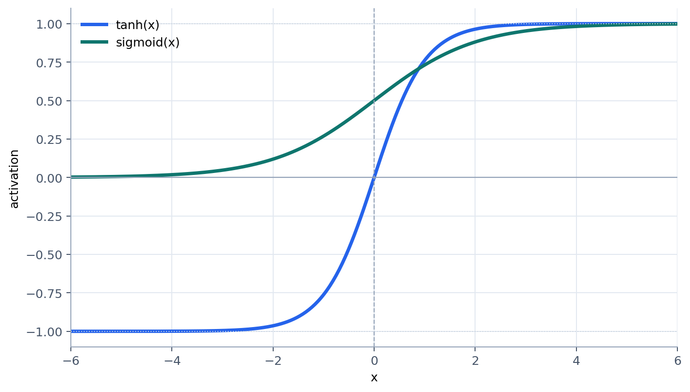
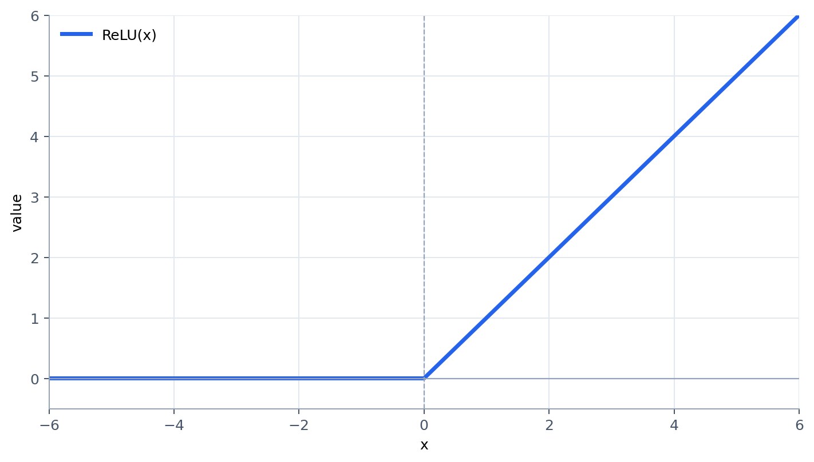

## Sigmoid 的问题

为了解决梯度消失问题，研究人员尝试了各种方法，但始终没能触及根本。在不断的尝试中，人们逐渐认识到，梯度消失的根源在于激活函数。

一直以来，神经网络中使用的激活函数都是 Sigmoid 函数，最初来源于 PDP 小组在 BP 的奠基性论文。之所以选择这个函数，因为这最像罗森布拉特的感知机里面使用的阶跃函数，又处处平滑可导。之所以要像阶跃函数，则是其来源于仿生学。此外，Sigmoid 函数能够完美呈现概率。它把所有值压缩在 0 和 1 之间，放在输出层可以直接解释为概率。

然而，我们都知道，Sigmoid 函数的导数在输入较大或较小时会接近于零，这就导致了梯度消失的问题。

## Tanh 函数

杨立昆（Yann LeCun）在研究卷积神经网络（Convolutional Neural Networks, CNN）的过程中提出了 Tanh 激活函数：

$$
\text{Tanh}(x) = \frac{e^x - e^{-x}}{e^x + e^{-x}}
$$

和Sigmoid函数相比，Tanh函数更适合做特征提取，更适合隐藏层用来把特征信号放大、扭曲、传递下去。

在 LeNet-5 中，Tanh 函数出现在每一个隐藏层之后，再加上 CNN 本身特有的非全连接，让 CNN 网络没有遇到梯度消失的问题。

## ReLU 函数

虽然辛顿是 Sigmoid 函数的忠实粉丝，但他也意识到了这个函数的局限性。然而，他始终找不到解决方法，直到又一个跨学科联想。

M-P 模型的生物学基础是神经元的全或无定律（All-or-None Law），即神经元产生的动作电位幅度是固定的，不管刺激多强，脉冲永远是大概 100 毫伏。然而，生物学家始终有个疑问，用羽毛轻抚过皮肤和用针刺皮肤是显然不同的两种感受，如果神经元只能处理简单的 0-1，那是无法处理这种程度问题的。

为了解决这个疑惑，生物学家采用了大量的实验工作。最终，神经生理学家艾伦·霍奇金（Alan Hodgkin）在枪乌贼的轴突上发现了神经元的单侧线性响应特性。当输入电流超过某个阈值时，神经元开始发放脉冲，且频率可以从 0 开始连续、平滑地增加。这与当时数学家想象的阶跃函数完全不同。它证明了神经元不是简单的逻辑开关，而是一个模拟-数字转换器，且转换函数是线性的。

辛顿受到这个发现的启发，提出了 ReLU（Rectified Linear Unit）函数：

$$
\text{ReLU}(x) = \max(0, x)
$$

最初，辛顿将 ReLU 函数引入玻尔兹曼机中。由于导数为 1，ReLU 使得梯度可以无损地向前传播，解决了深层网络中的梯度消失问题。后来，辛顿推荐自己的学生亚历克斯·克里泽夫斯基（Alex Krizhevsky）在 AlexNet 中使用 ReLU，最终在 ImageNet 比赛中取得了革命性的成功。自此之后，ReLU 成为了深度学习中最常用的激活函数。

## ResNet

ReLU 的成功极大地震撼了当时的学术界，人们痴迷于其简单的形式和强大的性能，开始疯狂加深网络层数，如大名鼎鼎的 GoogleNet 和 VGGNet。然而，当时的人们发现，当神经网络的层数超过 30 层时，训练误差反而增加了，这让人们开始怀疑深度学习是否真的可行，甚至一度认为深度学习的物理极限就是 30 层。

出现这一问题的原因正是因为 ReLU 函数这个解决了梯度消失问题的大功臣。由于 ReLU 在输入小于 0 时输出为 0，这意味着在训练过程中，某些神经元可能会死掉（即永远输出 0），这导致梯度信号的方差每传播一层就减半，最终在深层网络中，信号变得微弱得像是把一滴墨水滴进了太平洋一样，完全消失了。

为了稳定训练过程，何恺明（Kaiming He）从训练的起点入手，提出了 He Initialization 方法。他意识到，既然 ReLU 关掉了一半的神经元，那么为了保持信号强度不变，权重初始化的方差应该乘以 2。这个简单的修正被称为 He Initialization，取代了原先的 Xavier Initialization。依靠这个改进，何凯明和他的团队成功训练了一个 22 层的网络，在 ImageNet 上实现了首次超越人类视觉水平的错误率（4.94%，人类为 5.1%）。

与此同时，Google 也几乎在同一时间推出了 Batch Normalization。Batch Normalization 则在每一层设置一个检查站，无论输入信号如何偏移，都强行将其拉回正轨。这种机制使得训练过程更加稳定，甚至加速了网络收敛。

既然二者都这么强，何恺明自然想到，如果把 He Initialization 和 Batch Normalization 结合起来使用，是否能进一步提升网络的性能呢？于是，他们搭建了一个在当时看来非常深的网络（56 层），远超过之前的 22 层。然而，结果却令人震惊：56 层的网络不仅测试集表现更差，连训练集误差都比 22 层更高。

何恺明发现，这并不是过拟合问题，而是一种新的现象，称为退化问题。退化问题可以形象地称之为画蛇添足。假设网络的前 20 层已经找到了完美的特征表示，整个网络的剩下 36 层完全可以什么都不做，这样就得到了最优解。然而，它们被设计成必须对数据进行加权、求和、激活，这意味着如果将后 36 层看成一个函数映射 $F(x)$，必须有 $F(x) = x$ 才能保持前 20 层的完美结果不被破坏。这显然太难了。

为了解决这个问题，何恺明提出了残差网络（ResNet）。在 ResNet 中，每一层都会将输入直接传递到输出，并与经过卷积、激活等操作后的结果进行相加。这意味着对于每一层，其输出可以表示为：

$$
y = F(x) + x
$$

如果 $F(x)$ 学习到的特征表示不如输入 $x$，网络可以选择让 $F(x) = 0$，这样输出就等于输入，避免了画蛇添足的问题。

通过这种设计，ResNet 成功地训练了一个 152 层的网络，在 2015 年的 ImageNet 上取得了显著的性能提升（分类错误率 3.57%），并且彻底解决了深层网络中的退化问题。

随着 ResNet 的成功，深度学习进入了一个新的时代，CNN 成为了计算机视觉（Computer Vision, CV）领域的绝对霸主。2017 年，ImageNet 宣布将不再举办比赛，计算机视觉领域的世界杯落幕了。