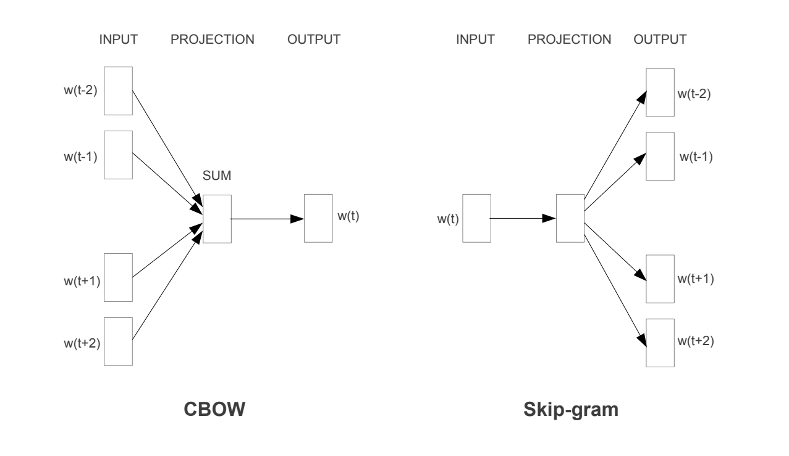
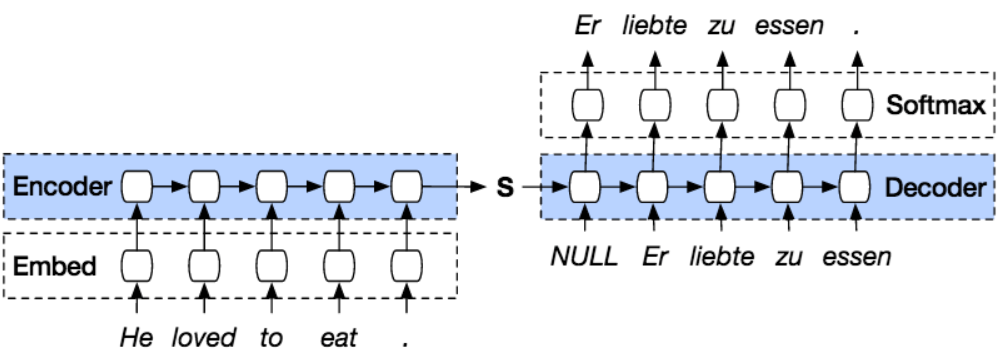

## RNNLM

2010 年，托马斯·米科洛夫（Tomas Mikolov）在论文中提出了 RNNLM（Recurrent Neural Network Language Model），将循环神经网络（Recurrent Neural Network, RNN）引入了语言模型，替代了 NPLM 中的 FNN。

通过引入循环结构，模型可以更好地记住之前的输入，从而更准确地预测下一个词。此外，RNN 自身的特性也意味着语言模型摆脱了 NPLM 的固定窗口限制。NPLM 只能看到前面固定的几个词，而 RNN 可以通过隐藏状态不断积累历史信息，从而更自然地处理序列。

## Word2Vec

米科洛夫在研究 RNNLM 时注意到了一个非常有趣的现象：RNNLM 学出来的词向量并不是杂乱无章地散落在空间中，它们在语义空间里表现出了某种稳定的线性关系。最著名的例子就是：

$$
King - Man + Woman \approx Queen
$$

这意味着，词向量不仅能表达 “猫” 和 “狗” 比 “猫” 和 “汽车” 更接近，还能把某些抽象关系编码成方向。例如，从 Man 到 King 的方向，可能对应着某种 “成为王” 的语义变化，并且和 Woman 到 Queen 的方向相似。而且这不是特例，国家到首都、动词原形到过去式等关系也都表现出了类似的线性结构。

有了这个发现，米科洛夫提出思考：RNNLM 的目标其实是为了得到一个完整的语言模型，但训练过程中也得到了词向量这个副产品。相当于用一个复杂的模型训练得到了两个产物：语言模型和词向量。能不能将这两步拆开，第一步训练一个模型得到词向量，第二步再用这些词向量去训练一个完整的语言模型？如果可以，考虑到词向量中最有价值的语义关系表现为线性结构，RNNLM 中的 RNN 和为了给模型引入非线性表示能力的激活函数是不是都是多余的，可以抛弃？如果可以，这将极大降低词向量的训练难度和计算资源消耗。

最终，2012 年，米科洛夫在论文《Efficient Estimation of Word Representations in Vector Space》中提出了 Word2Vec 模型。

Word2Vec 的网络结构大致可以表示为：

即一层输入层，一层 Projection 层（线性变换层），一层输出层。

Word2Vec 有两种训练方式：CBOW（Continuous Bag of Words）和 Skip-gram。CBOW 的目标是根据上下文词预测中心词，而 Skip-gram 则是根据中心词预测上下文词。

基于 CBOW 训练时，输入是一个表示上下文的词向量。如果用 $w_t$ 表示中心词，…… $w_{t-2}$、$w_{t-1}$、$w_{t+1}$、$w_{t+2}$ …… 表示上下文的词，那么输入 Projection 层的向量就是一个固定窗口内所有上下文词向量的平均值：

$$
\mathbf{v}_{context}
= \operatorname{avg}(
\mathbf{v}_{w_{t-c}},
\cdots{},
\mathbf{v}_{w_{t-2}},
\mathbf{v}_{w_{t-1}},
\mathbf{v}_{w_{t+1}},
\mathbf{v}_{w_{t+2}},
\cdots{},
\mathbf{v}_{w_{t+c}}
)
$$

其中，$c$ 是上下文窗口的窗口半径，$\mathbf{v}_{w_i}$ 是词 $w_i$ 的词向量。

$\mathbf{v}_{context}$ 经过线性变换后，输出层通过 softmax 函数输出一个概率分布，表示中心词 $w_t$ 是词表中每个词的概率。损失通过 BP 算法传播，更新词向量和线性变换的权重。

基于 Skip-gram 训练时，输入是中心词的词向量 $\mathbf{v}_{w_t}$，经过线性变换后，输出层通过 softmax 函数输出一个概率分布，表示上下文词 $w_{t+i}$ 是词表中每个词的概率。由于 $\mathbf{v}_{w_t}$ 需要预测多个上下文词，训练过程中会对每个上下文词单独进行损失计算和参数更新，即创建多个（中心词，上下文词）对，每对都进行一次训练。

由于使用 Softmax 函数计算输出层的概率分布需要对整个词表进行归一化，计算量非常大。为了提高训练效率，Word2Vec 进一步引入了负采样（Negative Sampling）技术。

负采样的核心思想是：在训练过程中，并不需要对整个词表进行归一化计算，而是只关注当前正样本（正确的上下文词）和少量负样本（随机选取的错误上下文词）。

具体来说，对于模型的输入（CBOW 的上下文词向量或 Skip-gram 的中心词向量），不再计算整个词表的概率分布，而是对当前输入确定一个正样本（CBOW 的中心词 $w_t$ 或 Skip-gram 的上下文词 $w_{t+i}$）和 $k$ 个负样本（从词表中随机选取的 $k$ 个词）。模型计算输入向量与这 $k+1$ 个词的输出向量之间的相似度，对于正样本希望结果尽可能接近 1，对于负样本则希望结果尽可能接近 0。

为了表示相似度，Word2Vec 使用了向量点积作为输入向量和输出向量之间的相似度度量，即

$$
\begin{aligned}
&\text{similarity}(\mathbf{v}_{input}, \mathbf{v}_{output}) \\
&= \mathbf{v}_{input} \cdot \mathbf{v}_{output} \\
&= \|\mathbf{v}_{input}\| \|\mathbf{v}_{output}\| \cos(\theta)
\end{aligned}
$$

其中，$\theta$ 是输入向量和输出向量之间的夹角。

最终，Word2Vec 通过负采样大幅降低了训练的计算量，使得在大规模语料上训练高质量词向量成为可能。训练完成后，得到的词向量不仅能够捕捉到词与词之间的语义关系，还具有很强的泛化能力，在各种 NLP 任务中都表现出了优异的性能。

更重要的是，Word2Vec 开启了通用预训练 + 下游具体任务微调的实现范式。从 Word2Vec 开始，人们往往基于迁移学习的思路搭建自己的模型：

1. 加载预训练的词向量模型（如 Word2Vec）

2. 在通用模型的基础上接上下游任务的特定层（如 LSTM，GRU 等）

3. 接上 Softmax 层进行分类或预测

可以说，现代的 LLM 基本沿用了这个范式

## Seq2Seq

虽然 Word2Vec 有诸多的优点，但它存在一个问题：它只能处理单词级别的语义关系，无法捕捉到句子级别的语义信息。于是，人们提出了 Seq2Seq（Sequence-to-Sequence）模型，试图通过一个端到端的神经网络来处理整个句子甚至段落的语义关系。

这里用 “人们”，是因为 Seq2Seq 模型有两个独立的发明者：Google 的伊尔亚·苏茨克维尔（Ilya Sutskever）和蒙特利尔大学的赵京铉（Kyunghyun Cho）。他们两个几乎同时认识到了 Word2Vec 的局限性，并尝试动手解决，最终殊途同归，分别独立提出了 Seq2Seq 模型。

### 伊尔亚的 Seq2Seq

由于 AlexNet 的成功，辛顿、亚历山大·克里泽夫斯基（Alex Krizhevsky）和伊尔亚三人为了打 ImageNet 比赛创立的公司被 Google 收购，三人得以进入 Google Brain 团队。值得一提的是，当时米克洛夫也在 Google Brain 团队，和伊尔亚的办公室离得很近，他们经常在同一个食堂吃饭。最终，米克洛夫解决了 “词” 的问题，伊尔亚解决了 “句” 的问题。虽然他们在最著名的那两篇论文上没有互署名字，但他们其实都在一个团队里。

当时，Google Brain 团队的目标是要把机器翻译做得更好。之前的翻译系统主要是基于统计方法的 SMT（Statistical Machine Translation），它的核心思想是通过统计分析大量的双语文本来建立翻译模型。虽然 SMT 在当时取得了一定的成功，但它存在一些局限性，比如无法很好地捕捉长距离依赖关系，难以处理复杂的句子结构等。

伊尔亚作为一个拥有深度学习信仰的人，他坚信：既然深度神经网络（DNN）在图像分类上表现这么好，一定存在一个单一的、巨大的神经网络，能够直接把英文变成法文，中间不需要任何人工设计的模块。于是，他开始思考如何设计这样一个模型。

伊尔亚想到，翻译的本质就是计算 $P(Target \mid Source)$，即给定源句子，生成目标句子的概率。他想到，RNN，特别是 LSTM，在这种任务下非常的合适。如果用一个 LSTM 把源句子读一遍，不管是长是短，读完后，LSTM 内部的 Hidden State 就包含了这句话的全部意思。再用另一个 LSTM，根据刚才读到的意思，一个字一个字地把目标语言写出来。这样就可以在完全不进行人工设参与，端到端地完成翻译的工作。

想法很好，但实现时却遇到了麻烦。

普通的 RNN 或 LSTM 根本记不住长句子。如果输入一句话有 50 个词，读到最后，开头的词早就忘光了。如果连输入都记不住，更别说输出了。这便是 RNN 架构的梯度消失（Vanishing Gradient）问题。伊尔亚的解法是深层 LSTM（Deep LSTM），他极为暴力地堆叠了 4 层 LSTM。为了了让这个模型能够训练起来，他还发挥自己的硬件功底，手动管理了 4 块 GPU 之间的数据同步。

在训练过程中还碰到了梯度爆炸的问题，伊尔亚直接引入梯度裁剪，当梯度超过某个阈值时，就把它裁剪到这个阈值。虽然这种方法看起来有点鲁莽，但在当时算力资源充沛的 Google，这种大胆的尝试是完全可行的。

另一个问题是巨大的词汇量带来的计算挑战。为了计算每个词的概率，模型需要对整个词表进行 Softmax 计算。对此，背靠着 Google 的伊尔亚选择了工程暴力和简单的 Full Softmax，他利用 GPU 的并行能力，硬生生地把几十万分类的计算量扛了下来。也就是说，在伊尔亚提出的 Seq2Seq 模型中，计算每个词的概率时需要对整个词表计算得分并归一化。

### 赵京炫的 Seq2Seq

伊尔亚研究 Seq2Seq 的动机来源于 Google 的工程需求，而赵京炫的动机则来源于对向量压缩的狂热。

当时的赵京炫刚从芬兰阿尔托大学博士毕业，来到蒙特利尔大学做博士后。他和搭档德米特里·巴赫达诺夫（Dzmitry Bahdanau）没有工程上需要解决的问题，却有着强烈的对向量压缩的狂热。他们相信，人类的任何一句思想，无论多复杂，都可以被无损地压缩成一个固定长度的数学向量。这在当时是个狂妄和离经叛道的想法，它认为语言的本质是可以被压缩和解压的。

和伊尔亚一样，他们也想到了编码器和解码器的配合工作。当然，也遇到了同样的问题。

由于蒙特利尔大学的计算资源有限，他们无法像伊尔亚那样暴力堆叠 LSTM，不得不对 LSTM 的门控电路作精简。赵京炫把遗忘门和输入门合并成了一个 “更新门”，去掉了细胞状态，创造一个阉割版的 LSTM，一个新模型结构，GRU（Gated Recurrent Unit）。事实证明，虽然初始的目的是为了让模型可以在有限的显存下跑起来，但这个简化版的 LSTM 竟然跑得更快，效果也没有掉。他们借此解决了梯度消失的问题。

另一方面，面对巨大的词汇量，赵京炫团队显然不能像伊尔亚那样暴力地计算 Full Softmax。为了解决这个问题，赵京炫团队提出了一种基于重要性采样的方法，其核心思路是：我们没有必要计算所有词的概率，只要随机抽 100 个词算一下平均值，然后根据采样概率加权修正。只要抽样是科学的，这个估计值在数学期望上就等于真实值。

这个设计思路带有非常明显的本吉奥团队风格，参考了统计学中的蒙特卡洛方法，而蒙特卡洛方法则基于概率论中的大数定律和中心极限定理。

于是，在没有 Google 那样的超级算例资源的情况下，赵京炫团队通过算法上的创新，成功地训练了 Seq2Seq 模型。

最终，两组人马殊途同归，几乎在同时提出了 Seq2Seq 模型：

其实，无论是伊尔亚还是赵京炫，他们提出 Seq2Seq 模型时都没能解决一个困扰着整个 RNN 谱系模型的核心问题：长距离依赖问题。虽然他们通过深层 LSTM 和 GRU 解决了梯度消失的问题，但对于非常长的句子，模型仍然难以捕捉到开头和结尾之间的依赖关系。谁也不知道，这个问题的解决最终彻底改变了整个深度学习领域的发展轨迹，甚至可以说改变了世界。
