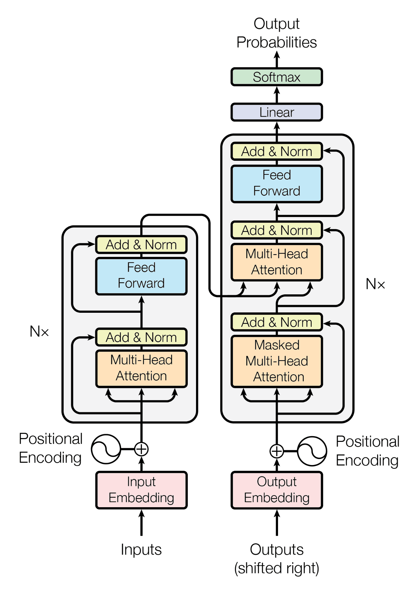

一切故事都要从那篇著名的论文《Attention Is All You Need》说起。不过，在那之前，我们还是要往前看，看看那些为 Transformer 的诞生铺路的技术积累。

## Attention

Seq2Seq 模型虽然很成功，但在长句子翻译上始终存在问题。可惜的是，问题的根源正是催生出这个模型的核心假设：一个句子中的所有信息是可以用一个固定长度的向量来表达的。事实是，当句子变长时，这个固定长度的向量就无法容纳所有的信息了。这就像让人用一个词来概括一整段话一样，随着段落变成，这个词就越来越难以表达所有的意思了。

在研究这个问题的过程中，Google Brain 团队的 Bahdanau 产生了一个重要的洞见：虽然人在说话时是有顺序的，但在理解和翻译时思维是跳跃的。人在看某个词时，其实会在这个词的前文中来回观察，寻找相关的信息来理解这个词的意思。于是，Bahdanau 在 2014 年提出了注意力机制（Attention）的概念，改进了 Seq2Seq 模型。

在 Seq2Seq 中，解码器的工作流程是一个自回归的过程。生成每个输出 $c_i$ 时，解码器只参考上一个输出 $c_{i-1}$。Bahdanau 修改了这个流程，在生成每个输出 $c_i$ 时，解码器不仅参考上一个输出 $c_{i-1}$，还参考过去的所有输出 $c_1, c_2, \cdots, c_{i-1}$，对他们进行加权平均，得到一个上下文向量 $c_{context}$，即

$$
c_{context} = \sum_{j=1}^{i-1} \alpha_j c_j
$$

其中，$\alpha_j$ 是注意力权重，由一个小型神经网络计算得到。输入是当前解码器的隐藏状态和编码器的输出。

值得注意的是，Bahdanau 只认识到了在解码阶段引入注意力机制的好处，但他没有在编码阶段引入注意力机制。他认为人只有在写作的时候才会跳跃，而在阅读的时候是线性的，所以编码阶段还是要用 RNN 来处理。这正是他的局限所在。不过，他的创新很大程度上为 Transformer 的诞生做出了启发。

## 从词到 Token

Token 这个概念出现得很早，由 Philip Gage 在 1994 年提出。当时的目的在于解决数据压缩问题。大致的意思是，在二进制和文本中经常有重复的字符串出现，如果把常见的字符串或字节对合并、替换成一个信息的符号，就可以用更短的表示来压缩数据。

假设这样一段文本：

```text
low lower lowest
```

由于 `l` 和 `o` 经常一起出现，我们可以把它们合并成一个新的符号 `lo`。如果我们继续观察文本，发现 `lo` 和 `w` 也经常一起出现，我们可以把它们合并成一个新的符号 `low`。

上述过程不断重复，直到达到预设的合并次数或词表大小。

2016 年，Google 的研究员 Rico Sennrich 等人将这个概念引入到 NLP 领域，提出了 Byte Pair Encoding（BPE）算法。

其核心思想是通过统计分析文本中出现频率最高的字节对（或字符对），将它们合并成一个新的符号，从而构建一个更紧凑的词表。这种做法有效解决了 Word2Vec 和 Seq2Seq 中词表过大的问题。

在此之前，Word2Vec 和 Seq2Seq 的词表通常是基于单词的，为了避免过大的词表，通常会设置一个频率阈值，只保留出现频率较高的单词，其他单词则被替换成一个特殊的 `<UNK>`（未知）标记。这种做法虽然可以控制词表大小，但会导致大量的信息丢失，特别是对于低频词和新词。BPE 通过将常见的字节对合并成新的符号，能够在保持词表大小可控的同时，减少信息丢失，提高模型对低频词和新词的处理能力。

从那时起，Token 就成为了 NLP 模型的基本单位，取代了之前的单词，直到现在。

## Transformer

有了之前的技术积累，到 2016 年的时候，Google 的翻译使用的已经是 LSTM + Attention 的 Google Neural Machine Translation（GNMT）模型了。

虽然 GNMT 的效果很好，但速度实在是太慢了。LSTM 的串行计算使得即使 Google 拥有全世界最强的 TPU/GPU 集群，也还是只能看着 token 一个一个输入，一个一个输出，完全不能并行计算。

为了解决这个问题，Google Brain 团队的八位科学家（Jakob Uszkoreit、Ashish Vaswani、Noam Shazeer、Niki Parmar、Llion Jones、Aidan N. Gomez、Łukasz Kaiser 和 Illia Polosukhin）开始了探索。

### 正弦位置编码

RNN 擅长处理序列问题，本质上是因为它能够捕捉序列中元素之间的关系。通过串行的计算，RNN 能够逐步积累上下文信息，从而理解序列中的关系。所以，RNN 理解到的关系是基于 “先后” 的关系。

在这个问题上，Transformer 推翻了 RNN 的假设，认为顺序，或者说位置，只是数据的一个特征，所以完全可以把它变成一个向量，和其他特征一起输入到模型中，由 Attention 一并处理。

于是，Transformer 团队实现了正弦位置编码（Sinusoidal Positional Encoding），为每个 token 提供了一个位置编码。这样，Transformer 可以不再关心顺序，并行地处理数据的输入。

### Self-Attention

在解决了顺序的问题之后，Transformer 团队开始以 Attention 为主角构建整个网络的架构。原来的 Attention 被升级成了自注意力机制（Self-Attention）。他们设计了一套极其精妙的数学机制，被称为 Query-Key-Value（QKV）模型。

这套机制用四个步骤，实现了对内容中每一个 token 之间关系的计算。

1. 角色分发。

    对于输入中的每一个 token（向量 $X$），通过三个不同的线性变换矩阵（$W_Q$, $W_K$, $W_V$），把它分裂成三个向量：

    - **Q** - 查询向量（Query）：代表我在寻找什么信息。当我是查找的发起者时，我拿 Q 去找别人。
    - **K** - 键向量（Key）：代表我是什么。当我是被查找的对象时，我拿 K 让别人来找我。
    - **V** - 值向量（Value）：代表我的信息是什么”。当别人找到我时，他们得到的是 V。

    这种做法相当于把原来 RNN 放在隐藏层里的内容给拆分开了，Q 和 K 只关心相似度，他们表达 token 之间的关系，V 用来表达 token 本身的信息。

2. 计算相关性。

以下面这个句子为例：

```text
苹果 掉 在 了 牛顿 的 头上。
```

这里面一共有“苹果、掉、在、了、牛顿、的、头上”，一共七个 token。每一个 token 都会变成三个向量。

计算相关性时，“苹果” 这个 token 站起来，拿着它的 Q，大声问所有 token（包括它自己）：

“我是 ‘苹果’，我想知道在这个句子里，谁能定义我的身份？”

句子里的其他 token 纷纷亮出自己的 K。系统开始计算 “苹果” 的 Q 和所有 token 的 K 的相似度。

计算结果大致是这样的一张表格：

| Q | K | 原始打分（Attention Score） |
|---|---|---|
| 苹果 | 苹果 | 2.0 |
| 苹果 | 掉 | 1.2 |
| 苹果 | 在 | -0.6 |
| 苹果 | 牛顿 | 2.4 |

3. 归一化。

通过 Softmax 函数把匹配度变成权重，也就是把原来这些 token 之间的两两之间的关系，变成一个在这个群体里面相对的关系，这些关系的总的和为 1。

4. 信息聚合。

基于第 3 步计算得到的权重，我们可以对所有 token 的 V 进行加权平均，得到一个新的向量，这个向量就是 “苹果” 的新的表示。我们通常记为 $Z_{\text{苹果}}$，可能是这样的：

$$
Z_{\text{苹果}} = 0.6 \times V_{\text{牛顿}} + 0.3 \times V_{\text{掉}} + 0.1 \times V_{\text{苹果}}
$$

上面的整个流程只是一次 Self-Attention 的计算过程。Transformer 的架构是由多层这样的 Self-Attention 组成的，每一层都会形成一个新的向量。经过多次计算，我们会得到一个拥有大量维度的，且储存了大量和其他 token 的关系的，能表达 “苹果” 这个概念的，丰富的词向量。

这种做法得到的词向量和 Word2Vec 中的词向量最大的区别在于，Word2Vec 的词向量是静态的，无论在什么语境下某个词的表示都是一样的。而 Transformer 的词向量是动态的，句子中每个 token 的表示都会根据它与其他 token 的关系而变化，即不同语境下同一个 token 的表示也会不同。此外，Transformer 的词向量还包含了位置信息，当 token 的位置发生变化时，它的表示也会发生变化。

有了 Self-Attention 机制，Transformer 在编码阶段就可以并行计算所有的输入 token，因为每个 token 的计算只依赖三个矩阵 （$W_Q$, $W_K$, $W_V$）和输入 token 本身，而不依赖于其他 token 的计算结果。这就实现了真正的并行计算，大大提升了模型的效率。

### Multi-Head Attention

在自然语言中，一个词往往不是单一角色的，它同时身兼数职。

例如这样一个句子：

```text
The animal didn't cross the street because it was too tired.
```

这个句子中的 “it” 包含有多个关系：

- 指代关系：它指代的是前文的 “animal”，而不是 “street”。

- 语法关系：它是句子的主语，和谓语动词 “was” 有关系。

- 修饰关系：它被形容词 “tired” 修饰，表示状态。

如果只有一个注意力头（Attention Head），即只计算一个 Self-Attention，那么模型只能在一个权重中同时体现这些关系。这意味着模型的权重不得不混合多个关系到一个表示中，可能会导致信息的丢失或混淆。

为此，Transformer 引入了多头注意力机制（Multi-Head Attention）。对于输入的 token，同时计算多个 Self-Attention。每个 Self-Attention 称为一个注意力头（Attention Head），用于单独学习一种关系。最终的输出先把所有注意力头的输出拼接在一起，再经过一个线性变换得到最终的表示，即

$$
\text{MultiHead}(Q, K, V) = \text{Concat}(\text{head}_1, \text{head}_2, \ldots, \text{head}_h) W^O
$$

LSTM 之所以没有类似的问题，是因为它在处理序列时是逐步积累上下文信息的，每一步的隐藏状态都包含了前面所有 token 的信息。因此，LSTM 可以在每个时间步中捕捉到不同类型的关系，而不需要像 Transformer 那样显式地计算多个注意力头。

Multi-Head Attention 为 Transformer 提供了更强的表达能力。理论上，Attention Head 的数量越多，模型就能捕捉到更多的关系。这也是 Transformer 在处理复杂语言现象时优于 RNN / LSTM 的原因之一。

### 残差连接、层归一化和 FFN

梯度消失几乎是所有深度神经网络都会遇到的问题，Transformer 也难逃宿命。Google 的团队发现，Attention 层堆叠到 6 层以上时就会发生梯度消失。因为 Attention 本质上是加权平均，随着深度的增加，信息特征会逐渐被稀释，变得模糊不清。

好在当时何恺明已经提出了 ResNet，于是 Transformer 也引入了残差连接（Residual Connection），解决了深度网络训练困难的问题。

此外，Transformer 在训练过程中还出现了 Loss 忽上忽下，或者直接爆出 NaN 的问题。这也是 Attention 层本身过于脆弱导致的。

Self-Attention 的核心计算是点积。随着向量维度的增加，点积的结果会变得非常大。而Softmax 里面的指数函数 $e^x$ 会把这些大数值之间的差距进一步按指数比例扩大。最后，Softmax 的输出会变得非常极端，除了最大的那个值之外，其他的值几乎都为 0。

为了解决这个问题，Transformer 参考 CNN 中的 Batch Normalization（也是 Google 提出的），引入了层归一化（Layer Normalization）。在 BN 中，归一化是纵向的，即对同一个 Batch 中的所有样本进行归一化。而在 NLP 中，序列长度不一致，Batch 中的样本可能有不同的长度，因此纵向归一化并不适用。于是，Transformer 采用了层归一化，对每个样本的所有特征进行归一化处理。这个办法一定程度上解决了 Self-Attention 中数值不稳定的问题，使得模型的训练更加稳定。

Transformer 的架构中，除了 Attention 层之外，还有一个前馈神经网络（Feed-Forward Network，FFN）。这是因为仅仅通过 Attention 机制融合了输入 token 的信息，还不足以让模型充分利用它的知识。FFN 的作用是对 Attention 输出的向量进行进一步的处理和变换，使得模型能够更好地捕捉复杂的语言现象和关系。此外，万能逼近定理（Universal Approximation Theorem）告诉我们，神经网络之所以能拟合任意复杂的函数，靠的是激活函数（如 ReLU）带来的非线性变换。因此，引入 FFN 和激活函数是为了让模型具备更强的表达能力，能够拟合更复杂的函数关系，从而提升模型的性能。

最终，Transformer 小组抛弃了传统无聊的学术论文命名，直径了披头士的歌曲《All You Need Is Love》，将这篇论文命名为《Attention Is All You Need》。这个命名看似嚣张，但现在回头看其实恰如其分。事实证明，从此以后，不只是 NLP，整个 AI 领域都进入了一个全新的时代。

