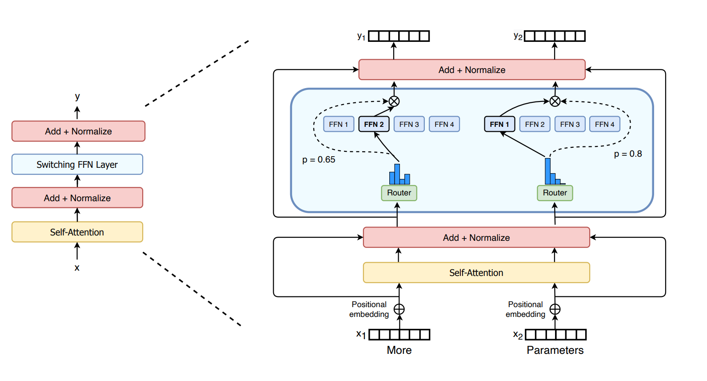

除了多模态，GPT-4 还给业界带来了另一个惊喜：MoE（Mixture of Experts，混合专家模型）。

不过这并不是一个新发明，而是对旧思想的重新应用。

## 理论提出

早在 20 世纪 90 年代，辛顿团队就已经提出过混合专家模型的思想。他们关心的问题是 “串扰”：如果一个单一模型要同时处理性质很不一样的数据子集，不同任务之间可能会互相干扰。比如高速行驶和倒车入库都属于开车，但前者需要极其细微的方向调整，后者却需要大幅度转向。如果让同一个网络用同一套参数处理所有情况，就容易出现左右互搏。

这种情况在实际生活中非常多，这也是现实复杂性的一种体现。人类是怎么解决这个问题的呢？显然，人类有一种具体问题具体分析的方法。但怎么将这种思考方式应用到神经网络中呢？辛顿从生物学中找到了启发。

20 世纪 50-60 年代，神经生理学家 David Hubel 和 Torsten Wiesel 提出了感受野的概念。这个概念是如此重要，他们凭借这个概念获得了 1981 年的诺贝尔生理学或医学奖。他们发现，大脑皮层中的某一个神经元，并不是对整个视野都有反应，它只负责监视视野中极小的一块区域。

这个概念让辛顿发现，大脑处理问题的方式和我们设计的网络结构不一样，主流的全连接神经网络 MLP 是违反感受野原则的。这或许是串扰问题如此明显的重要原因。感受野的核心思想是局部性和专一性，辛顿将这两个特性加载到神经网络中，提出了 MoE 的概念。

感受野分工的方法是座标，每个神经元负责的是某个具体的物理区域。神经网络需要的分工方式是语义，体现为输入空间。于是辛顿用多个专家网络代替了单一网络，每个专家网络负责不同的输入空间，从而让每个专家网络有其专业分工。

此外，辛顿为了避免强制分工过于僵硬，引入了门控网络的概念。门控网络会根据输入为每个专家分配权重，从而动态分配任务给不同专家。

这便是 MoE 的核心思想和设计，今天使用的 MoE 仍然沿用了这个基本框架，只是在细节上不断优化和改进。



除了实验验证，辛顿团队中的迈克尔·乔丹 (Michael I. Jordan) 和甘利俊一 (Shun-ichi Amari) 也从黎曼几何和流形的角度，为 MoE 提供了另一种理解。现实数据往往分布在复杂、不规则的流形上。用一个单一的 Dense 网络去拟合整个复杂流形，就像用一整张大纸去包裹一个形状复杂的物体，容易产生褶皱和变形。如果把它拆成多个局部专家，每个专家拟合流形的一小块区域，整体上反而可能更贴合真实数据分布。

不过，虽然 1991 年辛顿提出了数学理论，但在随后的 20 多年里，MoE 一直停留在小规模实验或理论探讨阶段，因为当时的硬件根本无法支持这种复杂的条件计算。直到 2017 年，MoE 才被 Transformer 的八位作者之一的诺姆·沙泽尔 (Noam Shazeer) 用一篇论文《Outrageously Large Neural Networks: The Sparsely-Gated Mixture-of-Experts Layer》带到了工程领域。

## 工程实现

当时 Transformer 尚在襁褓之中，并不为世人所知。诺姆是在 LSTM 上实现了 MoE 的概念。2020 年，他正式将 MoE 纳入 Transformer，使用 GShard 框架在 2048 个 TPU 上训练了一个 600B 参数的多语言翻译模型。这是 MoE 在 Transformer 上的第一次大规模应用。

诺姆在实现过程中解决了 MoE 在工程上遇到的两个关键问题，他的解决方案事实上成为了目前 MoE 实施的标准参考方式。

第一个问题是算力节约。辛顿团队提出的原始理论中，所有专家都会被分配权重（虽然有的很小），这导致计算量并没有显著减少。诺姆引入了 Top-k 机制，强行让 K 个以外的专家权重归零。

第二个问题是马太效应。这个问题在辛顿团队提出数学概念时甚至没有预料到，而它是如此严重，以至于如果没有得到妥善处理的话，整个理论在工程上根本不能实现。

训练刚开始时，负责分配任务的模型（路由器）由于是随机初始化的，所以它其实对任务该怎么分配完全没有理解，是随机乱分的。这导致训练初期的路由器可能会因为随机初始化的微小差异，偏向某个专家。这个专家获得了更多的梯度更新，参数变得越来越精，性能上变得由于其他专家。于是正反馈循环开始出现：越常被选中的专家越强，越强的专家越常被选中。相反，那些早期没有得到足够训练机会的专家，会逐渐变成闲置专家。它们接不到 token，也得不到有效梯度更新，最后可能永远停留在很弱的状态。

为了打破这个螺旋，诺姆修改了 Loss 函数，加入了负载均衡损失：

```text
Loss = Loss_task + λ * Loss_balance
```

这样的设计要求模型在保证任务性能的同时，也要保证每个专家的负载均衡。只要某个专家接单太多，负载均衡损失就会暴增，从而迫使路由器选择其他专家来接单。通过在不同训练阶段调整 λ 参数，可以干预门控网络的训练，避免出现某些专家过度饱和而其他专家闲置的情况。

## GPT-4 的 MoE

虽然诺姆被认为是 MoE 在工程上的实现者，但 Google 却没能做出商业化的尝试，因为 MoE 虽然降低了单次推理的延时，但当时 Google 最好的模型 Switch Transformer 虽然在架构上足够先进，但在推理时的吞吐量却不如传统 Transformer，即使用上了 MoE，推理速度仍然对于 Chat 类应用不可接受（主要是通信开销）。直到 OpenAI 的 GPT-4，MoE 才真正被应用到商业化的产品中。

GPT-4 在诺姆的基础上做了进一步优化。

诺姆的方案中采用的是千人军团，用了大量的小型专家，因为诺姆认为专家分的越细，节约的算力就越多。OpenAI 则从整体性能的角度考虑，专家越多，网络的通信开销越大，整体的速度也就越慢。而且OpenAI 当时坚信，Scaling Law 的红利还远远没有吃透。于是 GPT-4 采用了更少的专家，但每个专家的规模更大。GPT-4 的设计是 16 个大型专家，每个专家高达 111B 参数，总参数量达到 1.8T。在降低通信开销的同时，提高了整体推理速度。

第二个改动就是把诺姆的 Top-1 专家选择改成了Top-2，采用两个专家的融合来进行输出。OpenAI 发现，这种软性的知识融合对于逻辑推理能力至关重要，哪怕牺牲一点推理速度也是值得的。这让 GPT-4 能够理解复杂的隐喻、双关语，以及处理需要多领域知识的任务。这个改动也减小了训练时模型崩塌的可能性。

第三个改动是对丢弃策略的优化。这主要是硬件上的区别导致的。诺姆的实现是基于 TPU 的，框架是 TensorFlow，而 OpenAI 的实现是基于英伟达（Nvidia）的 GPU，框架是 PyTorch。GPU 的显存和计算能力都比 TPU 更强大，所以 OpenAI 使用了零丢弃策略，提高了数据的利用率。

经过这些改动，GPT-4 的 MoE 在推理速度上比诺姆的实现快了许多，同时在逻辑推理能力上也有了显著提升，在 Google 之前将 MoE 用到了商业化产品 ChatGPT 上。

## DeepSeek-MoE

经过大量的改良优化，GPT-4 成为了第一个在 LLM 中成功应用 MoE 的模型。从此，MoE 架构开始成为 Transformer 的主流方案。不过，GPT-4 的成功只证明了 MoE 可以帮助把模型做大。MoE 真正普及的原因则是因为被证明可以帮助把模型做得足够便宜。这次，唱主角的不是美国的 OpenAI、Google 或 Meta，而是一直名不见经传的中国团队。

2024 年 12 月 26 日和 2025 年 1 月 20 日，全球人民分别在西方的圣诞节和中国的春节期间收到了两份 AI 行业送出的大礼：DeepSeek-V3 和 DeepSeek-R1。来自中国初创公司深度求索的两款模型横空出世，让 MoE 彻底成为了全行业的金标准。

DeepSeek 在此之前籍籍无名，只凭借一款产品就成为了顶流，搅黄了整个行业研究人员的假期。

DeepSeek 的母公司幻方量化（High-Flyer Quant）其实是一家基金公司，由几名浙江大学毕业生在 2015 年创办，创始人叫梁文锋。

从名字就能看出来，幻方的主业是量化投资。梁文锋团队早在 2008 年左右就开始尝试用计算机技术进行程序化交易。当大多数量化同行还在用线性回归、多因子模型等传统统计学方法，幻方则极其激进地引入了深度学习。

到 2019 年前后，幻方已经成长为中国顶级私募之一，管理规模突破百亿。随着规模扩大，他们又选择自建算力集群。2020 年他们启动了萤火一号，一年后又做扩容，共耗资十亿人民币打造了包含 10,000 张 NVIDIA A100 显卡的超算集群，为后来 DeepSeek 的大模型训练积累了算力、工程和调试经验。

要知道，2021 年全球能拿出 1 万张 A100 专门用于单一任务训练的机构可以说是屈指可数。幻方当时的算力储备，绝对处于全球第一梯队，甚至可以直接对标硅谷的顶级科技巨头。Meta 在 2022 年 1 月才宣布构建 AI Research SuperCluster。当时宣布的第一阶段规模是 6,080 张 A100。Tesla 在 2021 年正在疯狂训练全自动驾驶FSD。马斯克在 6 月透露，他们当时的旗舰集群大概使用了 5,760 张 A100。理论上，幻方手里的 1 万张 A100 的算力是当初训练 GPT-3 那套集群的 3-6 倍。

不过，算力只是 DeepSeek 入场的门票，并不是它真正改写行业格局的原因。它真正让行业震动的地方，在于用一系列架构和工程优化，把 MoE 的成本优势发挥到了极致。

DeepSeek 在专家设置上和 GPT-4 很不同。他们发现，GPT-4 的 16 个专家的设置在实际推理过程中存在严重的多义性问题。为此，DeepSeek 的团队对 MoE 的架构做了优化，增加了专家数量。他们提出的细粒度混合专家方案被称为 DeepSeek-MoE。

当然，OpenAI 选择 16 个专家的设置是有原因的。MoE 架构最大的价值是节约推理时的算力，但是会相应的增加对通信带宽的控制要求。对于 GPT-4 来讲，背靠微软 Azure，有着全世界最豪华的 GPU 集群，没有那么大的必要将专家分那么多。在通信复杂度和计算量之间，OpenAI 选择了降低通信复杂度。

DeepSeek 的团队则不一样。虽然有一万张卡，但这一万张卡大部分是 A100。而由于美国开始了芯片管制策略，DeepSeek 无法买到当时最新的 H100，不能仿照 OpenAI 的财大气粗，只好尽量让自己的方案在算力方面节约一些。至于更多专家带来的通信复杂度问题，DeepSeek 的团队依靠在量化领域积累的丰富经验，优化了 CUDA 内核和 InfiniBand 的通信策略。在通信网络复杂度和算力之间，他们选择了降低算力需求。

除了通信和算力二者的取舍问题，更多专家还会带来训练上的困难。OpenAI 当时是人类首次尝试这么大的参数规模，为了保证 1.8T 参数的模型能稳稳地训练出来，他们实际上选择了比较保守的方案。

OpenAI 的专家数量不多，沿用诺姆的 Auxiliary Loss（辅助负载均衡损失）方案基本上是可行的。DeepSeek 把专家数量又增加了 16 倍来到 256 个，调整辅助损失的参数成了天大的难题。于是，DeepSeek 的团队修改了诺姆的方案，他们不再使用辅助负载均衡损失，而是引入一个偏置项来让专家的选择更加均衡。

诺姆的 Auxiliary Loss 方案将负载均衡的目标直接加入到训练的损失函数中，导致模型为了负载均衡不得不牺牲任务性能。DeepSeek 的方案则柔和许多。路由器的训练任务只考虑专家对任务的契合程度，偏置项不参与反向传播。这样，路由器的训练任务就不会因为负载均衡而牺牲任务性能。

另一个 DeepSeek-MoE 的重要创新是共享专家。人类的知识可以划成两个部分：一部分是通用知识，另一部分是专业知识。MoE 的架构设计承认专业知识的存在，却忽略了通用知识的处理。

在传统的 MoE 架构中，如果某一个 token 的生成只需要通用知识，它仍然会不得不分配给某一个专家，导致通用知识在每个专家的参数中都存储了。而且，通用知识的重复存储导致各个专家之间的区分度不足，实际上导致了专家不够专业。

DeepSeek 对此的解决方案是设置共享专家。共享专家永远激活，不参与竞争，用于学习通用知识。而参与竞争的专家称之为特化专家，由路由器决定是否激活，用于学习专业知识。在一次推理中，主要的参数都来自特化专家，共享专家只占比较小的一部分。这个方案除了效果更好之外，还因为共享专家不参与竞争，导致其极大程度上参与了训练，整个模型训练时的梯度流也更加连续，稳定，降低了训练难度。

最终，DeepSeek 用 5% 的成本，做到了 GPT-4o 95% 的体验：

| 对比维度 | DeepSeek-V3 | GPT-4o / GPT-4 系列（估算） | 总结 |
| --- | --- | --- | --- |
| 训练成本 | 约 558 万美元（官方披露） | 约 1 亿美元以上 | DeepSeek 训练成本低约 20 倍 |
| 硬件规模 | 2048 张 H800 GPU | 数万张 A100/H100 GPU | DeepSeek 用更少硬件完成接近顶级模型的训练 |
| 训练时长 | 约 2 个月 | 数月 | DeepSeek 的工程效率更高 |
| 推理输入价格 | \$0.14 / 百万 Token | \$2.50 / 百万 Token | DeepSeek 便宜约 18 倍 |
| 推理输出价格 | \$0.28 / 百万 Token | \$10.00 / 百万 Token | DeepSeek 便宜约 36 倍 |
| 缓存命中价格 | \$0.014 / 百万 Token | \$1.25 / 百万 Token | DeepSeek 便宜接近 100 倍 |
| 单次推理激活参数 | 约 37B | 估算约 200B 以上 | DeepSeek 的稀疏激活更省算力 |
| 代码与数学能力 | 顶级，数学和代码表现尤其突出 | 顶级 | 基本同档，DeepSeek 在部分测试中微弱领先 |
| 中文能力 | 更懂中文语境、成语和本土文化 | 优秀，但有时更像翻译腔 | DeepSeek 更有优势 |
| 英文与多语言 | 优秀 | 世界级，更地道，小语种更强 | GPT-4o 更有优势 |
| 指令遵循 | 很好，但偶尔会发散 | 极其稳健 | GPT-4o 更稳 |
| 多模态能力 | V3 是纯文本模型 | 原生支持听、看、说 | GPT-4o 明显领先 |
| 知识广度与幻觉控制 | 百科知识略弱，偶有幻觉 | 知识覆盖更全，幻觉略少 | GPT-4o 更稳 |
| 综合结论 | 用极低成本做到接近顶级闭源模型的体验 | 综合能力和产品稳定性更强 | DeepSeek 的核心优势是架构效率和性价比 |

而且，DeepSeek 为 MoE 的普及做了很多贡献。GPT-4 虽然使用了 MoE，但 OpenAI 不再开源，人们没办法准确知道 GPT-4 MoE 方案的实现细节。Google 发了论文，但是 Google 的工作是基于 TPU 的，GPU 用户很难复现。DeepSeek 则执行了完全开源的策略，提供了模型权重、技术报告和训练细节，几乎达到了手把手教你复现的程度。如今在开源社区能够看到的 MoE 方案，几乎都参考了 DeepSeek 的方案。
