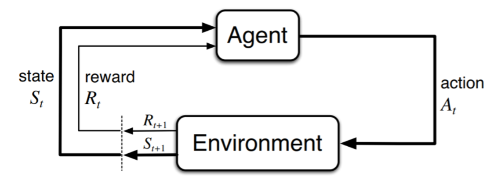

机器学习可以分为三种范式：监督学习、无监督学习和强化学习。强化学习的特点是模型在训练过程中的数据是由模型和环境交互得到的，这是与前两者最大的不同。

## 基本概念

强化学习的基本范式为：

其中，Agent（智能体）是我们训练的模型。在每个时刻 t，Agent 会根据当前的状态（State） $s_t$ 选择一个动作（Action）$a_t$。环境（Environment）会根据这个动作返回下一个状态 $s_{t+1}$ 和奖励（Reward） $r_t$。如此循环往复。

在训练和部署运行的过程中，Agent 内部会有一个策略函数（Policy Function） $\pi(a|s)$，它表示输入状态 $s$ 时选择动作 $a$ 的概率。它决定了 Agent 下一步会做什么。

此外，Agent 内还会有一个价值函数（Value Function） $V(s)$，它表示在状态 $s$ 下，未来可能获得的累积奖励的期望值。它反映了 Agent 对当前状态好坏的判断。

最理想的策略是让 Agent 在每个状态下都选择最优动作，称为最优策略（Optimal Policy），一般表示为 $\pi^*$。模型的训练目标就是让策略函数 $\pi$ 尽可能接近最优策略 $\pi^*$。最优策略对应的价值函数称为最优价值函数（Optimal Value Function），一般表示为 $V^*$。

为了让模型知道做出的动作的好坏，不断调整策略函数 $\pi$，最终得到 / 逼近最优策略 $\pi^*$，需要人为设计一个奖励函数（Reward Function）。它在每个时刻 t 都会给出奖励 $r_t$。由于 Agent 的目标被设计为尽可能获得最大化累积奖励（Cumulative Reward），因此他会不断尝试不同的动作，不断迭代策略，最终实现训练目标，找到最优策略 $\pi^*$。

累积奖励一般写作 $G_t$，表示从时刻 t 开始未来所有奖励的和：

$$
G_t = r_t + r_{t+1} + r_{t+2} + \ldots
$$

不过，这个算法会导致模型无法收敛。假设训练一个打游戏的 Agent，使用上面的计算方式会导致模型倾向于尽可能一直玩下去，而不是想办法赢游戏。

为此需要引入取值范围为 $[0, 1]$ 的折扣因子（Discount Factor） $\gamma$。累积奖励的计算方式变为：

$$
G_t = r_t + \gamma r_{t+1} + \gamma^2 r_{t+2} + \ldots
$$

根据等比数列求和公式，累积奖励是有限的，从而迫使 Agent 更多地学策略而不是拖时间。

这个设计也符合人类做决策的直观感受，越往后的好处越不准 / 越不重要。从朴素的经济学认知来说也是一样，越往后的收益越不确定，越不值得去追求。

## 适用条件

强化学习的适用条件是：环境得是一个马尔可夫决策过程（Markov Decision Process, MDP）。

假设存在这样的一个序列：

$$
s_0, a_0, r_0, s_1, a_1, r_1, s_2, a_2, r_2, \ldots
$$

如果给定当前状态 $s_t$ 和动作 $a_t$ 后，下一时刻状态 $s_{t+1}$ 的概率分布与更早的历史无关，即：

$$
P\left(s_{t+1} \mid s_t, a_t, s_{t-1}, a_{t-1}, \ldots\right)
=
P\left(s_{t+1} \mid s_t, a_t\right)
$$

则称环境满足马尔可夫性质，可以建模为马尔可夫决策过程（Markov Decision Process, MDP）。

一个常见的例子是下棋。下一个局面只依赖于当前局面和当前的落子，和之前怎么走的没有关系。

可以证明，如果一个问题可以建模为 MDP，那么至少存在一个确定性的最优策略。确定性的意思是，在每个状态下，最优策略的动作选择是唯一的。

## 分类

已经说过，强化学习的训练目标是找到最优策略。基于找最优策略的方法的不同，强化学习可以分为三类：

1. 基于模型（Model-based）的方法。
2. 基于值（Value-based）的方法。
3. 基于策略（Policy-based）的方法。

### Model-based

Model-based 方法是指在训练过程中，Agent 会尝试去学习环境的动态模型（Transition Model），即学习状态转移概率分布 $P(s_{t+1} | s_t, a_t)$。有了这个模型后，Agent 可以在内部模拟环境的行为，从而预测不同动作的结果，进而选择最优动作。

不过，由于依赖对环境模拟的准确性，Model-based 方法使用得并不多。

### Value-based

Value-based 方法是指在训练过程中，Agent 会尝试去学习价值函数 $V(s)$ 或者动作价值函数 $Q(s, a)$。

直观的例子还是下棋。相当于 Agent 给每个可能的局面都打分，每次落子都选择分数最高的那个局面。Agent 实际上不是在学怎么下棋，而是在学每个局面有多好。根据局面有多好来选择落子。

常见的算法包括：SARSA、Q-learning、Deep Q-Network（DQN）等。

### Policy-based

Policy-based 方法是指在训练过程中，Agent 会直接去学习策略函数 $\pi(a|s)$。它不需要显式地去学习价值函数，而是通过优化策略函数来找到最优策略。

常见的算法包括：REINFORCE、Actor-Critic 等。
