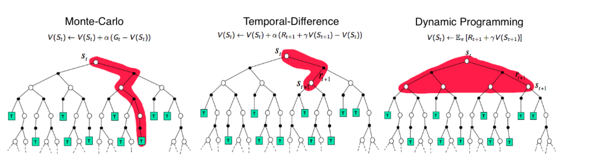

## TD 方法

MC 方法虽然摆脱了对环境转移概率的依赖，但仍然有一个问题：需要等到整个 Rollout 完成后才能计算累积奖励 $G_t$。如果任务本身就是持续性任务（没有明确的终止状态），或者一个 Rollout 很长，那么计算 $G_t$ 的等待时间就会很长，导致训练效率低下。

为此，人们将 MC 和 bootstrap 结合，提出了 TD（Temporal Difference）方法。

具体做法是，不再用整个 Rollout 的累积奖励 $G_t$ 更新 $Q_\pi(s, a)$，而是用当前时刻的奖励 $r_t$ 和下一时刻的 $Q_\pi(s_{t+1}, a_{t+1})$ 作为更新目标：

$$
Q_\pi(s_t, a_t) \leftarrow Q_\pi(s_t, a_t) + \alpha [r_t + \gamma Q_\pi(s_{t+1}, a_{t+1}) - Q_\pi(s_t, a_t)]
$$

当然，用估计值取代真实值不是全无代价的。这便是另一个经典问题：偏差（Bias）与方差（Variance）。事实上，这个问题并不只局限于强化学习，在整个机器学习中都存在。

偏差，是指模型预测值与真实值之间的差异。一个高偏差的模型通常过于简单，无法捕捉数据的复杂性，导致欠拟合（Underfitting）。方差，是指模型预测值在不同训练集上的变化程度。一个高方差的模型通常过于复杂，对训练数据的噪声过于敏感，导致过拟合（Overfitting）。

MC 方法使用真实值 $G_t$，因此是无偏（Unbiased）的。但由于需要等到整个 Rollout 完成才能计算 $G_t$，$G_t$ 受到中间多个随机事件影响，因此方差很大。

TD 方法使用估计值代替真实值，由于估计值本身可能存在偏差，因此 TD 方法是有偏（Biased）的。但由于只使用了当前时刻的奖励和下一时刻的估计值，减少了随机事件的影响，因此方差较小。

下图是对 DP、MC 和 TD 方法的对比：

## SARSA

如果将 TD 方法应用到 On-Policy 的方法中，就得到了 SARSA（State-Action-Reward-State-Action）算法。它的更新公式为：

$$
Q_\pi(s_t, a_t) \leftarrow Q_\pi(s_t, a_t) + \alpha [r_t + \gamma Q_\pi(s_{t+1}, a_{t+1}) - Q_\pi(s_t, a_t)]
$$

其中要求 $a_{t+1}$ 是按照当前策略 $\pi$ 选择的动作，即 $a_{t+1} \sim \pi$。

为了保证探索和利用的平衡，通常使用 $\epsilon$-Greedy 策略来选择动作。

## Q-Learning

如果把 TD 方法应用到 Off-Policy 的方法中，就得到了 Q-Learning 算法。它的更新公式为：

$$
Q_\pi(s_t, a_t) \leftarrow Q_\pi(s_t, a_t) + \alpha [r_t + \gamma \max_{a_{t+1}} Q_\pi(s_{t+1}, a_{t+1}) - Q_\pi(s_t, a_t)]
$$

特殊的是，Q-Learning 在选择 $a_{t+1}$ 时采用贝尔曼最优方程的贪婪策略，选择使得 $Q_\pi(s_{t+1}, a_{t+1})$ 最大的动作。这种做法使得 Q-Learning 在 Off-Policy 的情况下更加稳定。

当然，Q-Learning 也可以使用 $\epsilon$-Greedy 策略来选择动作。